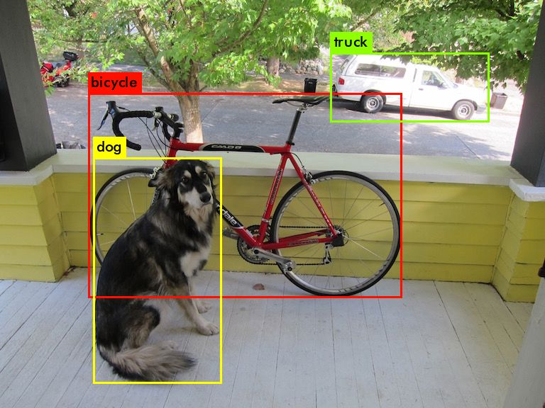
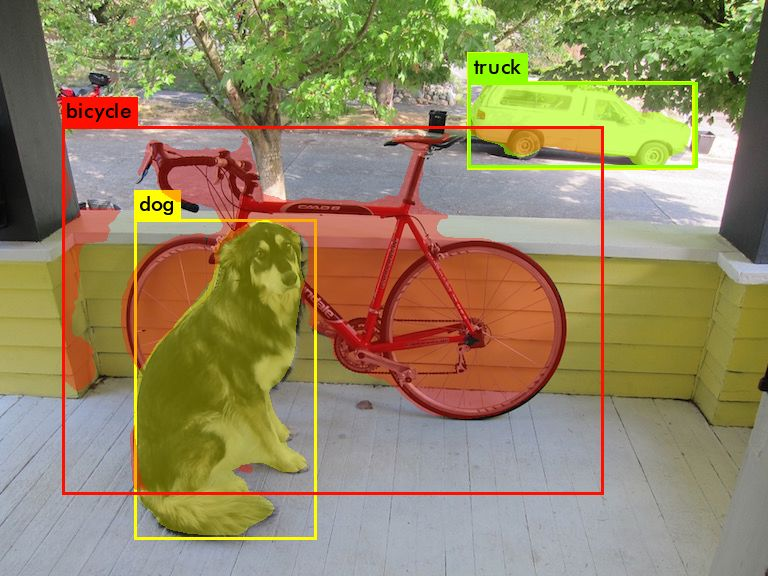
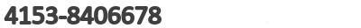

# mini2gguf

`mini2gguf` is a toolchain for converting compact vision models (mainly YOLO-family models) into GGUF, then running dynamic inference with [ggml](https://github.com/ggml-org/ggml).

Current scope:

- Model conversion: `pt/onnx/cfg+weights -> gguf`
- Runtime inference: dynamic graph execution + YOLO postprocessing (detection/segmentation) + CRNN postprocessing
- Example programs: detection demo and performance benchmark

## 1. Project Goals

The project is designed to simplify model packaging and deployment:

1. Convert models into a unified GGUF format (graph JSON is embedded in `model.graph` by default)
2. Run with one runtime across CPU/GPU backends
3. Provide ready-to-run demo and benchmark binaries

Current backend support:

- CPU
- CUDA
- Vulkan

## 2. Installation

### 2.1 System Requirements

Recommended environment:

- Linux
- CMake >= 3.20
- C/C++ compiler with C++17 support
- Python 3.10+

Backend-specific requirements:

- CPU: no extra dependencies
- Vulkan: Vulkan loader/driver/development packages installed
- CUDA: CUDA Toolkit (including `nvcc`) and a compatible NVIDIA driver

### 2.2 Python Dependencies (Converter)
Python >= 3.10

```bash
pip install -r requirements.txt
```

If you want to use the official YOLOv5 export path (`--export-backend yolov5`), follow [third_party/README.md](third_party/README.md).

## 3. Build (CPU / Vulkan / CUDA)

Top-level CMake options:

- `GGML_VULKAN=ON`: enable Vulkan (passes through to ggml)
- `GGML_CUDA=ON`: enable CUDA (passes through to ggml)

### 3.1 CPU (default)

```bash
cmake -S . -B build-cpu
cmake --build build-cpu -j
```

### 3.2 Vulkan

```bash
cmake -S . -B build-vulkan -DGGML_VULKAN=ON
cmake --build build-vulkan -j
```

### 3.3 CUDA

```bash
cmake -S . -B build-cuda -DGGML_CUDA=ON
cmake --build build-cuda -j
```

Optional (set GPU architecture explicitly):

```bash
cmake -S . -B build-cuda -DGGML_CUDA=ON -DCMAKE_CUDA_ARCHITECTURES=89
cmake --build build-cuda -j
```

## 4. Download Sample Models and Test Image

The following commands download sample models and a test image:

```bash
mkdir -p assets/models/yolo
mkdir -p assets/images

# test image
wget -O assets/images/dog.jpg https://raw.githubusercontent.com/pjreddie/darknet/master/data/dog.jpg

# darknet models
wget -O assets/models/yolo/yolov3-tiny.cfg https://raw.githubusercontent.com/pjreddie/darknet/master/cfg/yolov3-tiny.cfg
wget -O assets/models/yolo/yolov3-tiny.weights https://pjreddie.com/media/files/yolov3-tiny.weights
wget -O assets/models/yolo/yolov4-tiny.cfg https://raw.githubusercontent.com/AlexeyAB/darknet/master/cfg/yolov4-tiny.cfg
wget -O assets/models/yolo/yolov4-tiny.weights https://github.com/AlexeyAB/darknet/releases/download/darknet_yolo_v4_pre/yolov4-tiny.weights

# ultralytics pt models
wget -O assets/models/yolo/yolov5n.pt https://github.com/ultralytics/yolov5/releases/download/v7.0/yolov5n.pt
wget -O assets/models/yolo/yolov8n.pt https://github.com/ultralytics/assets/releases/download/v8.4.0/yolov8n.pt
wget -O assets/models/yolo/yolov9t.pt https://github.com/ultralytics/assets/releases/download/v8.4.0/yolov9t.pt
wget -O assets/models/yolo/yolov10n.pt https://github.com/ultralytics/assets/releases/download/v8.4.0/yolov10n.pt
wget -O assets/models/yolo/yolo11n.pt https://github.com/ultralytics/assets/releases/download/v8.4.0/yolo11n.pt
wget -O assets/models/yolo/yolo26n.pt https://github.com/ultralytics/assets/releases/download/v8.4.0/yolo26n.pt
```

## 5. Model Conversion (PT / ONNX / Darknet)

### 5.1 Darknet -> ONNX

```bash
python converter/darknet2onnx.py \
  --cfg assets/models/yolo/yolov4-tiny.cfg \
  --weights assets/models/yolo/yolov4-tiny.weights \
  --output-path assets/models/yolo/yolov4-tiny.onnx

for example:
python converter/darknet2onnx.py -c ./assets/models/yolo/yolov3-tiny.cfg -w ./assets/models/yolo/yolov3-tiny.weights
python converter/onnx2gguf.py -i ./assets/models/yolo/yolov3-tiny.onnx
```

### 5.2 ONNX -> GGUF

```bash
python converter/onnx2gguf.py \
  -i assets/models/yolo/yolov4-tiny.onnx \
  --model-family yolo
```

Notes:

- Default output: `<stem>.gguf` (graph JSON embedded in `model.graph`)
- `--split`: outputs `<stem>.json` + `<stem>.gguf` (graph and weights separated)

### 5.3 PT -> GGUF (YOLO)

Example (YOLOv26):

```bash
python converter/yolo2gguf.py \
  -i assets/models/yolo/yolo26n.pt \
  -v 26 \
  -c detection

for example:
python converter/yolo2gguf.py -i ./assets/models/yolo/yolo26n.pt -v 26 -c detection  
```

Example (YOLOv5, using official YOLOv5 exporter):

```bash
python converter/yolo2gguf.py \
  -i assets/models/yolo/yolov5n.pt \
  -v 5 \
  -c detection \
  --export-backend yolov5 \
  --yolov5-dir ./third_party/yolov5
```

If `--yolov5-dir` is not provided, the converter auto-searches:

- `./yolov5`
- `<repo>/third_party/yolov5`
- `../yolov5`

## 6. Run Demo (`yolo_demo`)

### 6.1 YOLO detection
YOLO detection demo:

```bash
./<build-dir>/examples/yolo_demo \
  -m assets/models/yolo/yolo26n.gguf \
  -i assets/images/dog.jpg \
  -o predictions.jpg \
  --conf 0.45 \
  --iou 0.45 \
  -a \
  -b auto

./build/examples/yolo_demo -m assets/models/yolo/yolov3-tiny.gguf -i assets/images/dog.jpg -o ./assets/images/predictions_dynamic.jpg --conf 0.45 --iou 0.45 -a
./build/examples/yolo_demo -m assets/models/yolo/yolo26n.gguf -i assets/images/dog.jpg -o ./assets/images/predictions_dynamic.jpg --conf 0.45 --iou 0.45 -a
```

Result preview:



Arguments:

- `-m, --model`: GGUF model path
- `-i, --input`: input image
- `-o, --output`: output image
- `--conf / --iou`: confidence and IoU thresholds
- `-a, --agnostic`: class-agnostic NMS
- `-b, --backend`: `auto|cpu|gpu|vulkanN|cudaN`

Examples:

- Force CPU: `-b cpu`
- Vulkan device 0: `-b vulkan0`
- CUDA device 0: `-b cuda0`

### 6.2 YOLO segmentation

Converter pt to gguf
```bash
wget -O assets/models/yolo/yolo26n-seg.pt https://github.com/ultralytics/assets/releases/download/v8.4.0/yolo26n-seg.pt
python converter/yolo2gguf.py -i ./assets/models/yolo/yolo26n-seg.pt -v 26 -c segmentation

wget -O assets/models/yolo/yolo11n-seg.pt https://github.com/ultralytics/assets/releases/download/v8.4.0/yolo11n-seg.pt
python converter/yolo2gguf.py -i ./assets/models/yolo/yolo11n-seg.pt -v 11 -c segmentation

wget -O assets/models/yolo/yolov5n-seg.pt  https://github.com/ultralytics/yolov5/releases/download/v7.0/yolov5n-seg.pt

```

Inference
```bash
./build/examples/yolo_demo -m assets/models/yolo/yolo26n-seg.gguf -i assets/images/dog.jpg -o assets/images/segment.jpg --conf 0.50 --iou 0.45

./build/examples/yolo_demo -m assets/models/yolo/yolo11n-seg.gguf -i assets/images/dog.jpg -o assets/images/segment.jpg --conf 0.50 --iou 0.45
```

Result preview:


## 7. Benchmark (`infer_performance_test`)

```bash
./<build-dir>/examples/infer_performance_test \
  -m assets/models/yolo/yolo26n.gguf \
  -f 0.0 \
  -b 20 \
  -d auto
```

Arguments:

- `-m, --model`: GGUF model path
- `-f, --fill_value`: input fill value
- `-b, --betch_iters`: benchmark iterations (typo kept for compatibility)
- `--bench_iters`: alias of `--betch_iters`
- `-d, --backend`: `auto|cpu|gpu|vulkanN|cudaN`

## 8. CRNN

### 8.1 Convert ONNX -> GGUF

```bash
python ./converter/crnn2gguf.py -i ./assets/models/crnn/ocr_number.onnx -d ./assets/models/crnn/dict_number.txt
```

### 8.2 Inference

```bash
./build/examples/yolo_demo -m assets/models/crnn/ocr_number.gguf -i assets/images/crnn-test.jpg
./build/examples/yolo_demo -m assets/models/crnn/ocr_number.gguf -i assets/images/crnn-test2.jpg
./build/examples/yolo_demo -m assets/models/crnn/ocr_number.gguf -i assets/images/crnn-test3.jpg
./build/examples/yolo_demo -m assets/models/crnn/ocr_number.gguf -i assets/images/crnn-test4.jpg
```

### 8.3 Input Samples

crnn-test.jpg： 

crnn-test2.jpg： 

crnn-test3.jpg： 

crnn-test4.jpg： 

## 9. Additional Notes

### A. Runtime Backend Selection

The runtime selects backend through environment variable `MINI2GGUF_BACKEND`.
The demo/benchmark binaries set this variable automatically via `-b` / `-d`.

### B. Metadata Recommendation

`yolo_demo` relies on `model.family=yolo` and `model.version` for postprocess dispatch.
If you convert ONNX manually, ensure metadata is set correctly (for example, `onnx2gguf.py --model-family yolo`).

### C. Converter Entry Points

- `converter/darknet2onnx.py`
- `converter/onnx2gguf.py`
- `converter/yolo2gguf.py`
- `converter/crnn2gguf.py`

For full converter arguments, run `--help` on each script.


## 10. GGML change
- Add OP support for GatherElements/Gather/ReduceMax for CPU/Vulkan/CUDA
- Add OP support for GRU/ReduceMean/Shape for CPU/Vulkan/CUDA
- Optimize Conv 2D because of performance for CPU backend 
- Support Conv F16 completely
